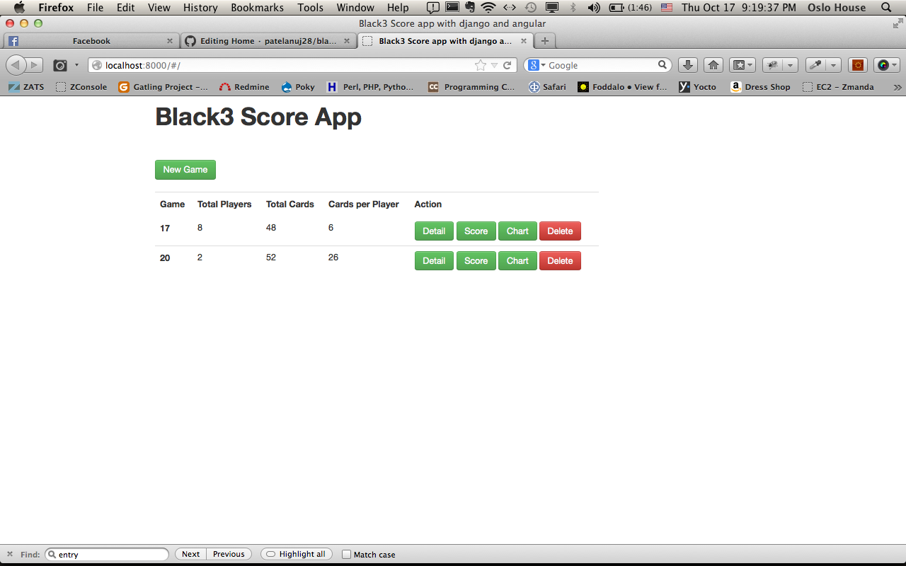
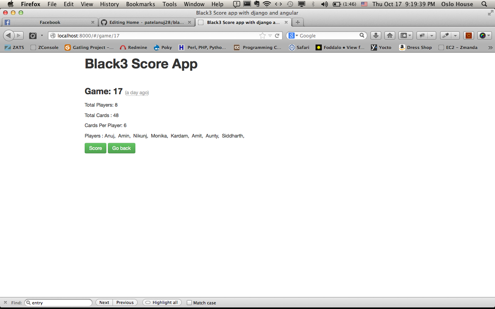
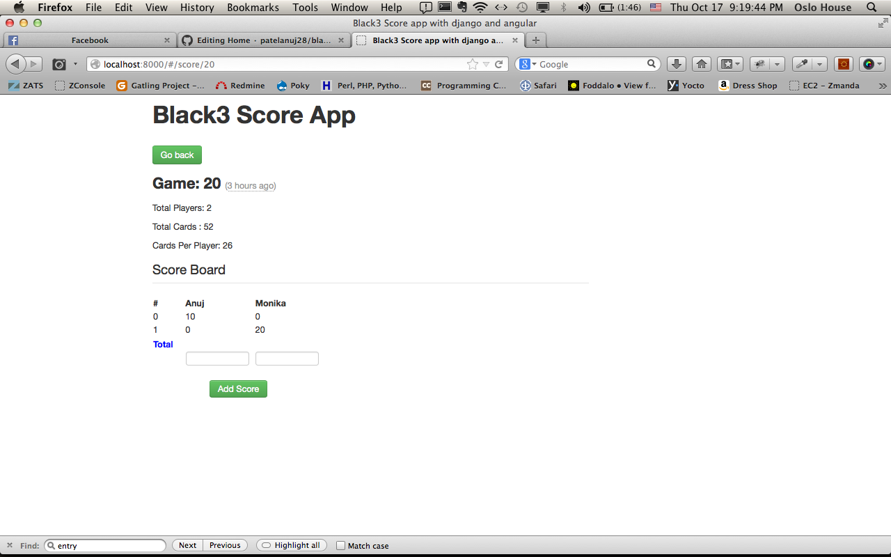
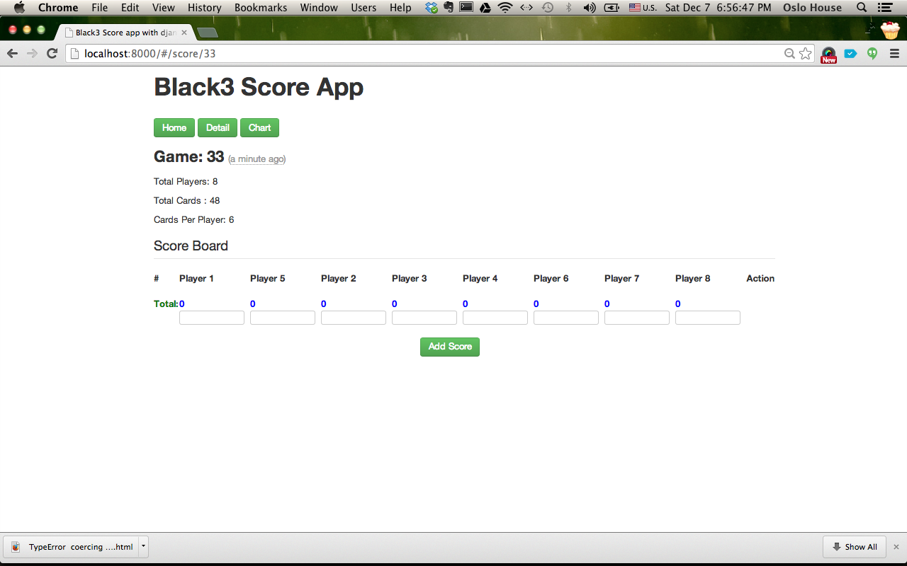
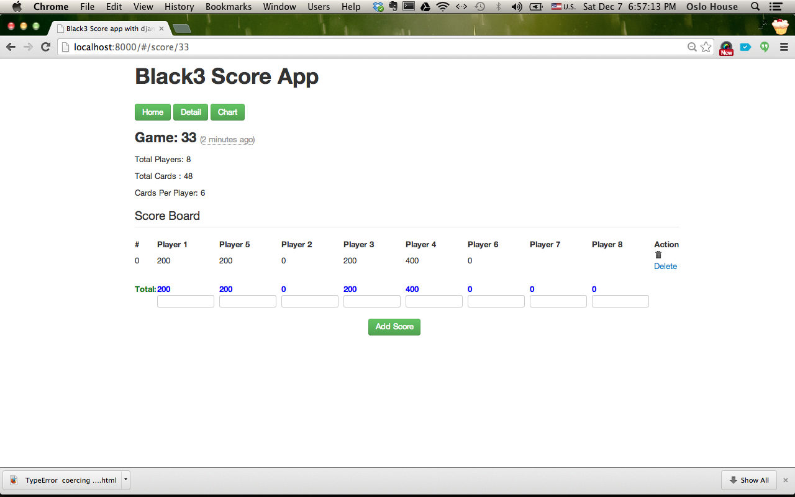
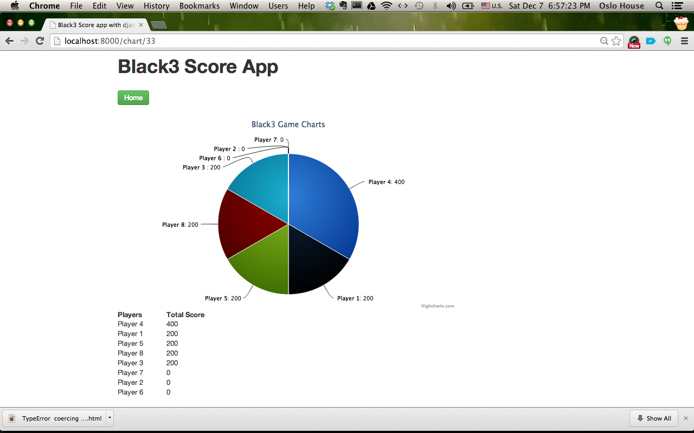

black3_score_board
==================

Apps created using Angular JS, Django, Chartit and Django Rest Framework

Thanks for looking at it. If you have any question please email me on 
patelanuj28[at]gmail.com

1.  virtualenv <<projectname>>
2.  cd <<projectname>>
3.  source bin/activate
4.  Clone the project from git hub repository
5.  install python django packages using below command
    pip install -r requirements.txt
6.  cd <projectname>/black3js
7.  ./manage.py runserver
8.  http://localhost:8000
9.  admin panel can be accessible from http://localhost:8000/admin/
10. django-rest api can be accissible from
	a. http://localhost:8000/api/game
    b. http://localhost:8000/api/players
    c. http://localhost:8000/api/score

Contact: 
Anuj Patel
patelanuj28@gmail.com
